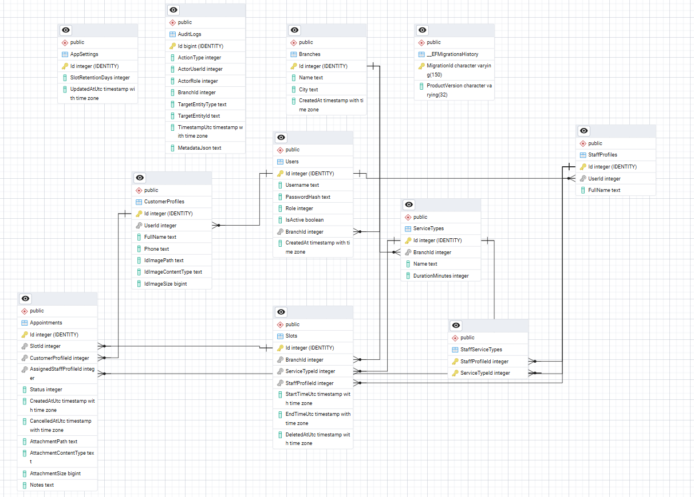

# FlowCare API
FlowCare is a RESTful API built with ASP.NET Core and PostgreSQL to manage branches, services, staff, slots, appointments, and audit logs.

---

## Technologies Used
- ASP.NET Core Web API
- Entity Framework Core
- PostgreSQL
- Git
- GitHub

---

## Features
- Role-based authorization (Admin, Branch Manager, Staff, Customer)
- Soft delete + hard delete cleanup
- Audit logging system
- Pagination & Search for listing APIs
- Queue position calculation per branch
- CSV export for audit logs

---

## Deliverables
- GitHub Repository: [FlowCare API](https://github.com/Sabrina-Barwani/FlowCare)
- Database Schema (ERD):

---

## Setup Instructions

### 1. Install requirements
You need:
- .NET 8 SDK
- PostgreSQL

---

### 2. Create database
Example:

CREATE DATABASE flowcare_db;

---

### 3. Configure connection string
Update the connection string in appsettings.json:

"ConnectionStrings": {
  "DefaultConnection": "Host=localhost;Port=5432;Database=flowcare_db;Username=postgres;Password=postgres"
}

---

### 4. Add migrations
Run this command in Package Manager Console:

add-migration "createDbTables"

This will create the migration.

---

### 5. Apply migrations
Run:

update-database

---

### 6. Run the project
Run the project (F5)

Swagger will open at:
https://localhost:7151/swagger/index.html

---

## Environment Variables
Example environment variables:
- DefaultAdmin Username=admin
- DefaultAdmin Password=Admin$123

---

## Database Seeding
The project automatically seeds initial data on startup.

Seeded data includes:
- 2 branches
- 3 service types per branch
- managers and staff
- sample customers
- sample slots

Seeding is idempotent (no duplicate data).

---

## Example API Usage

### Search Customers
GET /api/Customers?term={searchTerm}&page={pageNumber}&size={pageSize}

Example:
curl https://localhost:7151/api/Customers?term=99999999&page=1&size=10

---

### Create appointment
POST /api/appointments

Body example:
{
  "slotId": 1,
  "serviceTypeId": 1
}

---

### Get audit logs
GET /api/audit-logs

---

## Slot Retention & Cleanup
Slots use soft delete.

Admin can configure retention days:
PUT /api/admin/settings/slot-retention-days

Cleanup endpoint:
POST /api/admin/slots/cleanup

Cleanup is idempotent and safe.

---

## Author
Sabrina Al Barwani
